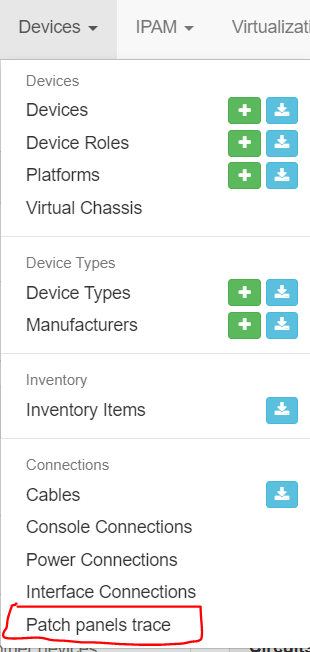
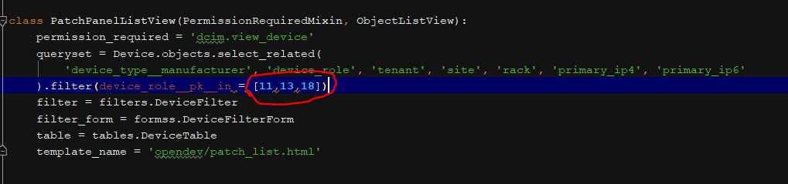
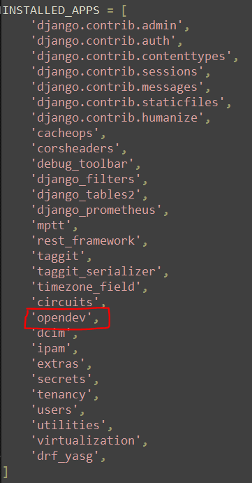
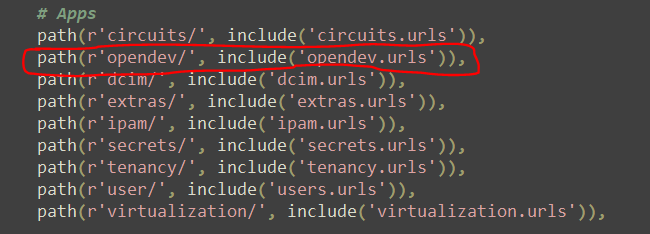
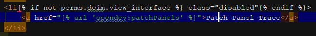

Quick guide to setup this custom functionality:

First of all copy this directory (patch_trace) under 'opt/netbox'

There's a script, 'init_patch_trace.sh', that sould be able to copy and rename the interested folders and files in the right place (step 1,2,3), 
if it doesn't work, follow all the steps :

1: Place 'opendev_code' under '/opt/netbox/netbox' and rename it to 'opendev'

2: Place 'opendev_template' under '/opt/netbox/netbox/templates' and rename it to 'opendev'

3: Under '/opt/netbox/netbox/templates/inc' replace 'nav_menu.html' with the custom one.
	This step adds a tile linked to the custom view under Devices in the nav_menu
	

	
4: Under 'opt/netbox/netbox/opendev' edit 'views.py' to replace roles with roles from your environment.

	
5: Under '/opt/netbox/netbox/netbox' edit 'settings.py' and add 'opendev' in installed apps

6: Under '/opt/netbox/netbox/netbox' edit 'urls.py' and add opendev's url in apps section

7: restart netbox (eg. on CentOs 'systemctl restart netbox')

Steps 3,5,6 have to be repeated everytime you update netbox.
During update, for the third step, instead of copying the whole file is better to add only the piece of HTML which adds the tile, to avoid canceling some UI added with the updates.

