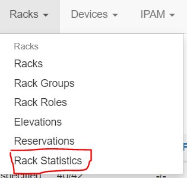
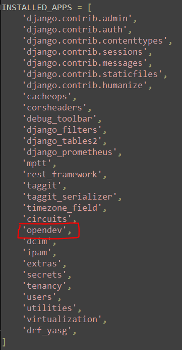
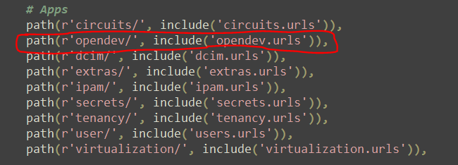
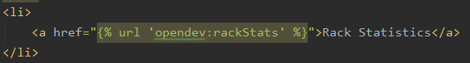

Quick guide to setup this custom functionality:

First of all, TAKE A BACKUP OF THE NETBOX FOLDER (/opt/netbox).

Then copy this directory (rack_statistics) under 'opt/netbox'.

There are two scripts, the first, 'init_rack_statistics.sh', sould be able to copy and rename the interested folders and files in the right place (step 1,2,3), 
if it doesn't work, follow all the steps.

The second script, get_rack_data.py, need to be scheduled daily (better at night), because if it's done real time, it's a little bit too slow,
it's used to retrieve and store ports data to not impact the databse with this view. 

1: Place 'opendev_code' under '/opt/netbox/netbox' and rename it to 'opendev'

2: Place 'opendev_template' under '/opt/netbox/netbox/templates' and rename it to 'opendev'

3: Under '/opt/netbox/netbox/templates/inc' replace 'nav_menu.html' with the custom one.
	This step adds a tile linked to the custom view under Devices in the nav_menu
	

	
4: Under '/opt/netbox/netbox/netbox' edit 'settings.py' and add 'opendev' in installed apps

5: Under '/opt/netbox/netbox/netbox' edit 'urls.py' and add opendev's url in apps section

6: restart netbox (eg. on CentOs 'systemctl restart netbox')

With this guide, everything should be installed correctly but it wont work until the code is adapted to the environment in which it's executed, 
specifically it is necessary to replace the "insert 'something' here" scattered in the code, so take a look at the code and make it run correctly.

Steps 3,4,5 have to be repeated everytime you update netbox.
During update, for the third step, instead of copying the whole file is better to add only the piece of HTML which adds the tile, to avoid canceling some UI added with the updates.

